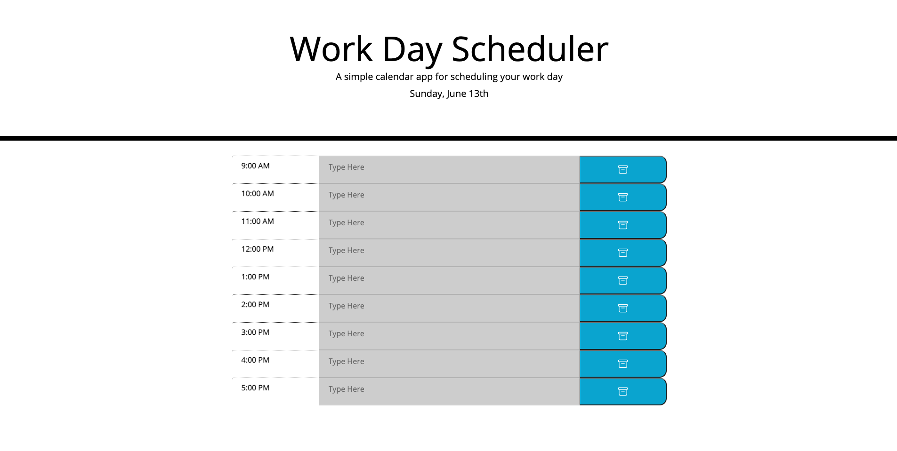

# WorkDayScheduler

## Purpose
As an employee with a busy schedule, this will help you stay organized and add important events to the daily planner to stay on track and manage time efficiently and effectively.

## Built With
* HTML
* CSS
* JavaScript
* jQuery
* Bootstrap
* Moment.js

## Preview

# Website
https://kingopara.github.io/WorkDayScheduler1/

# Credit 

## License
[MIT](https://choosealicense.com/licenses/mit/)

## Badges 
